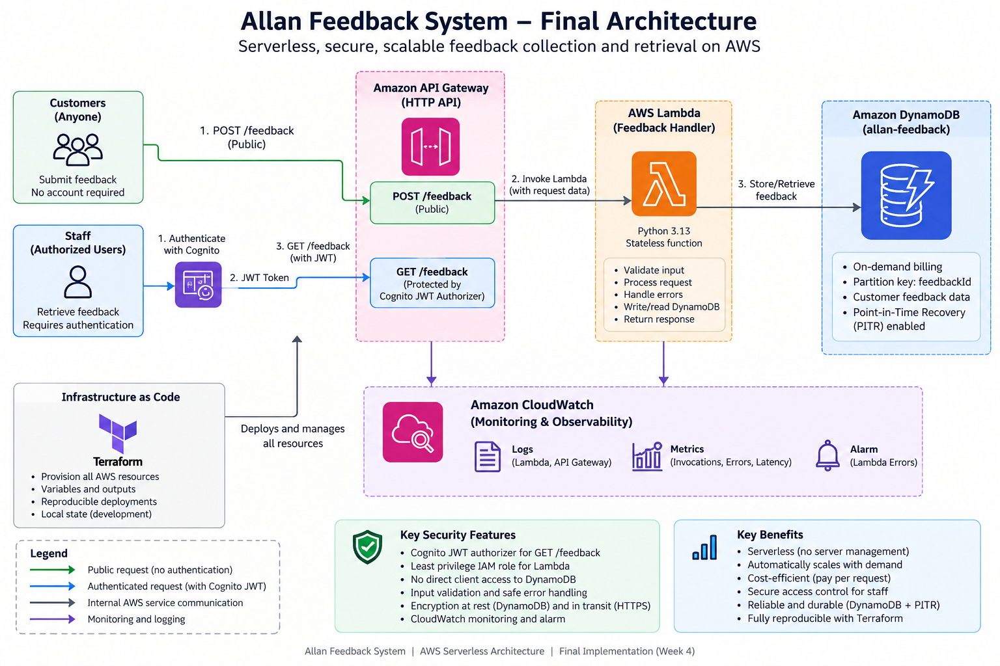
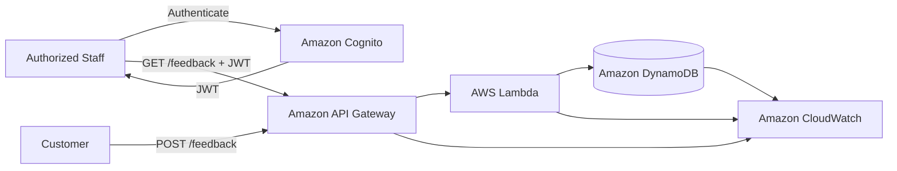

# Allan Feedback System

A serverless customer feedback API built on AWS using API Gateway, AWS Lambda, Amazon DynamoDB, Amazon Cognito, IAM, CloudWatch, and Terraform.

The system allows customers to submit feedback through a public API endpoint while protecting feedback retrieval behind Cognito JWT authentication for authorized staff.

---

## Table of Contents

- [Project Overview](#project-overview)
- [Business Problem](#business-problem)
- [Architecture](#architecture)
- [AWS Services](#aws-services)
- [API Design](#api-design)
- [Security](#security)
- [Monitoring](#monitoring)
- [Project Structure](#project-structure)
- [Prerequisites](#prerequisites)
- [Deployment](#deployment)
- [Terraform Configuration](#terraform-configuration)
- [Testing](#testing)
- [Cost and Scalability](#cost-and-scalability)
- [Current Limitations](#current-limitations)
- [Troubleshooting](#troubleshooting)
- [Documentation](#documentation)
- [Cleanup](#cleanup)

---

# Project Overview

The Allan Feedback System is a serverless AWS application for collecting and retrieving customer feedback.

Customers can submit feedback containing:

- rating
- category
- message
- optional customer name
- optional email address

Submitted feedback is validated by AWS Lambda and stored in Amazon DynamoDB.

Authorized staff can retrieve submitted feedback through a protected API route using Amazon Cognito authentication.

The infrastructure is provisioned and managed with Terraform.

---

# Business Problem

Organizations need a simple way to collect customer feedback without maintaining dedicated application servers or database infrastructure.

The system was designed to provide:

- public customer feedback submission
- input validation
- persistent serverless storage
- protected staff access
- centralized monitoring
- infrastructure as code
- low operational overhead
- usage-based scaling

A serverless architecture was selected because feedback traffic can be irregular and does not require continuously running compute resources.

---

# Architecture



The public `POST /feedback` route accepts customer feedback, while `GET /feedback` is protected by Amazon Cognito. API Gateway invokes AWS Lambda, Lambda reads and writes feedback in DynamoDB, CloudWatch provides logging and monitoring, and Terraform manages the infrastructure as code.

## High-Level Architecture



## Request Flow

### Customer Feedback Submission

```
Customer
   |
   | POST /feedback
   v
API Gateway
   |
   v
AWS Lambda
   |
   | Validate and PutItem
   v
Amazon DynamoDB
```

### Staff Feedback Retrieval

```
Staff
   |
   | Authenticate
   v
Amazon Cognito
   |
   | JWT
   v
API Gateway GET /feedback
   |
   v
AWS Lambda
   |
   | Scan
   v
Amazon DynamoDB
```

CloudWatch provides logging, metrics, dashboard visualization, and Lambda error monitoring.

---

# AWS Services

| Service | Purpose |
| --- | --- |
| Amazon API Gateway | Exposes the HTTP API |
| AWS Lambda | Runs validation, submission, and retrieval logic |
| Amazon DynamoDB | Stores feedback records |
| Amazon Cognito | Authenticates staff users |
| AWS IAM | Controls Lambda access to AWS resources |
| Amazon CloudWatch | Provides logs, metrics, dashboard, and alarm |
| Terraform | Provisions and manages AWS infrastructure |

The application is deployed in:

```
eu-central-1
```

The AWS region is configurable through Terraform variables.

---

# API Design

The application exposes two routes.

## POST /feedback

Public endpoint for customer feedback submission.

```
POST /feedback
```

Authentication is intentionally not required.

Example request:

```
{
  "customerName": "Jane Doe",
  "email": "jane@example.com",
  "rating": 5,
  "category": "service",
  "message": "The customer support was very helpful."
}
```

Successful response:

```
201 Created
```

Example response:

```
{
  "message": "Feedback submitted successfully.",
  "feedbackId": "generated-feedback-id"
}
```

## GET /feedback

Protected endpoint for staff feedback retrieval.

```
GET /feedback
```

A valid Cognito JWT is required.

Authorization header:

```
Authorization: Bearer <JWT_TOKEN>
```

Without valid authentication, API Gateway returns:

```
401 Unauthorized
```

With valid authentication, the endpoint returns:

```
200 OK
```

The current implementation retrieves up to 20 feedback records and orders them by submission timestamp with the newest records first.

Detailed API documentation is available in:

```
docs/api/api-design.md
```

---

# Input Validation

The Lambda function validates submitted feedback before storing it.

Current validation includes:

- rating must be an integer from 1 to 5
- category must be supported
- message must be present
- message must not be empty
- message must not exceed 2000 characters
- optional customerName must be a string
- optional email must be a string

Supported categories:

```
service
product
delivery
website
complaint
suggestion
other
```

Invalid requests return:

```
400 Bad Request
```

---

# Security

## Authentication

The GET route is protected by Amazon Cognito.

API Gateway uses a JWT authorizer to validate staff authentication before allowing access to feedback retrieval.

The POST route remains public by design because customers should not require staff accounts to submit feedback.

## IAM Least Privilege

The Lambda execution role is restricted to the DynamoDB operations required by the application:

```
dynamodb:PutItem
dynamodb:Scan
```

Permissions are scoped to the feedback table.

Clients do not receive direct DynamoDB permissions.

## Error Handling

Unexpected application failures return a generic client response.

Technical troubleshooting details are recorded in CloudWatch instead of being exposed through the API.

## CORS

The development API currently allows:

```
allow_origins = ["*"]
```

This is useful while no permanent frontend domain exists.

A production deployment should restrict allowed origins to trusted frontend domains.

## Secrets

Passwords and JWT tokens must never be stored in the repository.

Terraform state files, environment files, Python cache files, and temporary inspection directories are excluded from Git.

---

# Monitoring

Amazon CloudWatch provides observability for the application.

## Dashboard

Terraform creates:

```
allan-feedback-dashboard
```

The dashboard monitors:

### Lambda

- Invocations
- Errors
- Throttles
- Duration

### API Gateway

- Request Count
- 4xx responses
- 5xx responses

### DynamoDB

- ConsumedReadCapacityUnits
- ConsumedWriteCapacityUnits
- ReadThrottleEvents
- WriteThrottleEvents

## Lambda Error Alarm

Terraform creates:

```
allan-feedback-lambda-errors
```

The alarm monitors Lambda execution errors.

The current project does not create separate API Gateway or DynamoDB alarms.

## Lambda Logs

The Lambda log group is:

```
/aws/lambda/allan-feedback-handler
```

Log retention is configured for:

```
14 days
```

Detailed monitoring documentation is available in:

```
docs/monitoring.md
```

---

# Project Structure

```
.
|-- .gitignore
|-- README.md
|-- get-feedback-event.json
|-- invalid-event.json
|-- test-event.json
|
|-- docs/
|   |-- api/
|   |   `-- api-design.md
|   |
|   |-- architecture/
|   |-- cost-analysis.md
|   |-- monitoring.md
|   |-- testing.md
|   `-- well-architected-review.md
|
|-- lambda/
|   |-- feedback_handler.py
|   `-- feedback_handler.zip
|
|-- terraform/
|   |-- .terraform.lock.hcl
|   |-- main.tf
|   |-- missing-rating-event.json
|   |-- outputs.tf
|   |-- providers.tf
|   `-- variables.tf
|
`-- tests/
```

Local development files such as Terraform state, `.terraform/`, Python cache directories, and temporary ZIP inspection directories are intentionally excluded from source control.

---

# Prerequisites

Required software:

- Terraform
- AWS CLI v2
- Python 3.13 or compatible runtime
- Git
- PowerShell or another command shell
- AWS account with sufficient deployment permissions

Verify the tools:

```
python --version
terraform version
aws --version
git --version
```

Verify the active AWS identity:

```
aws sts get-caller-identity
```

---

# Deployment

## 1. Clone the Repository

```
git clone https://github.com/Allantez-del/allan-feedback-system.git
cd allan-feedback-system
```

## 2. Initialize Terraform

```
cd terraform
terraform init
```

## 3. Format the Configuration

```
terraform fmt
```

## 4. Validate Terraform

```
terraform validate
```

Expected result:

```
Success! The configuration is valid.
```

## 5. Review the Deployment Plan

```
terraform plan
```

Always review the proposed infrastructure changes before applying them.

## 6. Deploy

```
terraform apply
```

Review the plan and confirm the deployment when prompted.

## 7. View Outputs

```
terraform output
```

Terraform provides:

- API endpoint
- Cognito User Pool ID
- Cognito App Client ID

The API endpoint can also be displayed individually:

```
terraform output api_endpoint
```

---

# Lambda Deployment Package

Terraform deploys:

```
lambda/feedback_handler.zip
```

If `feedback_handler.py` is modified, rebuild the deployment ZIP before applying Terraform.

From the repository root in PowerShell:

```
Compress-Archive `
  -Path .\lambda\feedback_handler.py `
  -DestinationPath .\lambda\feedback_handler.zip `
  -Force
```

Then run:

```
cd terraform
terraform plan
terraform apply
```

The current Lambda function uses libraries available in the AWS Lambda Python runtime and does not require a separate third-party dependency package.

---

# Terraform Configuration

Terraform configuration is stored in:

```
terraform/
```

## Files

`main.tf`

Defines the main AWS resources, including:

- DynamoDB
- IAM
- Lambda
- API Gateway
- Cognito
- CloudWatch

`providers.tf`

Defines the AWS provider.

`variables.tf`

Defines configurable project values.

Current variables include:

```
aws_region
project_name
environment
```

Default values are:

```
aws_region   = eu-central-1
project_name = Allan Feedback System
environment  = dev
```

`outputs.tf`

Provides:

```
api_endpoint
cognito_user_pool_id
cognito_app_client_id
```

`.terraform.lock.hcl`

Records the selected Terraform provider versions and is intentionally committed to source control.

## Changing the AWS Region

The deployment region is controlled through:

```
var.aws_region
```

It can be overridden without editing `providers.tf`.

Example:

```
terraform plan -var="aws_region=eu-west-1"
```

## Terraform State

Terraform state is currently stored locally for this development project.

State files are excluded from Git.

A production deployment should use a secured remote Terraform state backend with appropriate access control and state locking.

---

# Testing

The system has been tested across successful requests, invalid input, authentication, error handling, and Terraform configuration.

## Main Results

| Test | Expected Result | Status |
| --- | --- | --- |
| Valid POST | 201 | Passed |
| Invalid feedback | 400 | Passed |
| GET without JWT | 401 | Passed |
| GET with valid JWT | 200 | Passed |
| Public POST after Cognito | 201 | Passed |
| Controlled server error | 500 | Passed |
| Terraform validate | Valid | Passed |
| Terraform plan after Week 4 refactor | No changes | Passed |

## POST Test

Example using PowerShell:

```
$api = terraform output -raw api_endpoint

$body = @{
    customerName = "Jane Doe"
    email        = "jane@example.com"
    rating       = 5
    category     = "service"
    message      = "The customer support was very helpful."
} | ConvertTo-Json

Invoke-RestMethod `
    -Method Post `
    -Uri "$api/feedback" `
    -ContentType "application/json" `
    -Body $body
```

Expected result:

```
201 Created
```

## Unauthorized GET Test

Calling GET without a JWT should return:

```
401 Unauthorized
```

## Authorized GET Test

A valid Cognito JWT must be supplied in the Authorization header.

JWT tokens must not be committed to Git or stored in project documentation.

Detailed test documentation is available in:

```
docs/testing.md
```

---

# Cost and Scalability

The system uses serverless and managed AWS services.

Primary cost drivers are:

- API Gateway requests
- Lambda requests and execution duration
- DynamoDB reads, writes, and storage
- CloudWatch usage
- Cognito authentication usage

The architecture avoids continuously running EC2 application servers.

DynamoDB uses:

```
PAY_PER_REQUEST
```

This is suitable for a workload with low or unpredictable traffic because capacity does not need to be permanently provisioned.

The architecture can scale from a small demonstration workload toward much larger traffic volumes without redesigning the complete application.

The main scaling and cost limitation is currently the GET access pattern.

GET uses:

```
DynamoDB Scan
```

For a large production dataset, this should be redesigned using Query-based access, suitable indexes, and pagination.

Detailed cost analysis is available in:

```
docs/cost-analysis.md
```

---

# Well-Architected Review

The project was reviewed against AWS Well-Architected principles covering:

- Security
- Reliability
- Performance Efficiency
- Cost Optimization
- Scalability
- Operational Excellence

Important strengths include:

- serverless architecture
- protected staff retrieval
- least-privilege database access
- managed AWS services
- DynamoDB Point-in-Time Recovery
- monitoring and logging
- infrastructure as code
- usage-based scaling

The complete review is available in:

```
docs/well-architected-review.md
```

---

# Current Limitations

The project is intentionally designed as a demonstration-scale serverless application.

Current limitations include:

- GET uses DynamoDB Scan
- GET returns a maximum of 20 records
- pagination is not implemented
- CORS currently allows all origins
- POST is public
- no AWS WAF configuration
- no custom API domain
- no frontend application
- Terraform state is local
- no CI/CD pipeline
- only one CloudWatch alarm is currently configured
- no cross-region disaster-recovery architecture

These limitations provide clear areas for future production improvement.

---

# Troubleshooting

## AWS Authentication Problems

Verify the active AWS identity:

```
aws sts get-caller-identity
```

If the AWS CLI session has expired, authenticate again using the configured AWS CLI authentication method.

---

## Terraform Initialization Problems

Run:

```
terraform init
```

If the provider installation is damaged, the local `.terraform` directory can be regenerated.

Do not delete `.terraform.lock.hcl` simply to solve a normal initialization problem; the lock file is intentionally tracked to keep provider selection reproducible.

---

## Terraform Permission Errors

If Terraform returns `AccessDenied`, verify that the AWS identity used for deployment has permissions to manage the required resources:

- Lambda
- DynamoDB
- API Gateway
- IAM
- Cognito
- CloudWatch

Review:

```
aws sts get-caller-identity
```

and:

```
terraform plan
```

before retrying deployment.

---

## Lambda Returns 500

Inspect the Lambda logs:

```
aws logs tail /aws/lambda/allan-feedback-handler --follow --region eu-central-1
```

Possible causes include:

- missing DynamoDB table
- insufficient Lambda IAM permissions
- invalid environment configuration
- unexpected DynamoDB error
- application exception

The API intentionally returns a generic internal-error response rather than exposing internal exception details.

---

## Lambda Code Changes Do Not Appear

Rebuild the deployment package:

```
Compress-Archive `
  -Path .\lambda\feedback_handler.py `
  -DestinationPath .\lambda\feedback_handler.zip `
  -Force
```

Then redeploy:

```
cd terraform
terraform plan
terraform apply
```

---

## GET Returns 401

This is expected when the protected route is called without a valid Cognito JWT.

Verify that the request includes:

```
Authorization: Bearer <JWT_TOKEN>
```

Do not store the token in Git.

---

## Browser CORS Problems

CORS is already configured in API Gateway.

The development configuration permits all origins and supports the required API headers and methods.

If a production frontend is deployed, replace the wildcard origin with the trusted frontend domain.

---

# Documentation

Detailed project documentation is available under `docs/`.

| Document | Purpose |
| --- | --- |
| `docs/api/api-design.md` | API routes, validation, authentication, and error handling |
| `docs/monitoring.md` | CloudWatch dashboard, metrics, logs, and alarm |
| `docs/testing.md` | Functional, validation, authentication, and Terraform tests |
| `docs/cost-analysis.md` | Cost drivers, serverless economics, and scaling |
| `docs/well-architected-review.md` | Security, reliability, performance, cost, scalability, and operations |

---

# Future Improvements

Potential production improvements include:

- replace DynamoDB Scan with Query
- implement pagination
- create suitable DynamoDB secondary indexes
- restrict CORS to a trusted frontend
- introduce API throttling and abuse protection
- consider AWS WAF
- add API Gateway 5xx alarms
- add Lambda throttling alarms
- add DynamoDB throttling alarms
- implement structured logging
- introduce automated tests
- implement CI/CD
- use remote Terraform state
- create separate dev, staging, and production environments
- add a frontend application
- evaluate asynchronous processing for high-volume workloads

---

# Cleanup

To destroy the AWS infrastructure:

```
cd terraform
terraform plan -destroy
```

Review the resources that will be deleted.

Then run:

```
terraform destroy
```

Destroying the environment can delete application resources and stored feedback data.

Do not destroy an environment containing data that must be retained without first considering the required backup or recovery process.

---

# Project Status

The project implements the core requirements of the AWS Serverless Customer Feedback System:

- public feedback submission
- protected feedback retrieval
- input validation
- DynamoDB persistence
- Cognito authentication
- least-privilege IAM access
- CloudWatch logging and monitoring
- Lambda error alarm
- DynamoDB Point-in-Time Recovery
- Terraform infrastructure as code
- API testing
- security testing
- Well-Architected review
- cost and scalability analysis

---

## Author

**Allan Mwangi**

AWS Serverless Customer Feedback System
