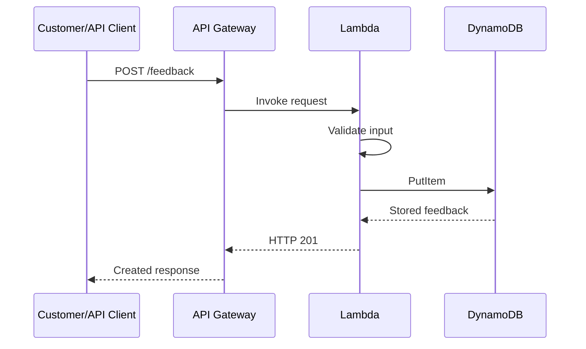
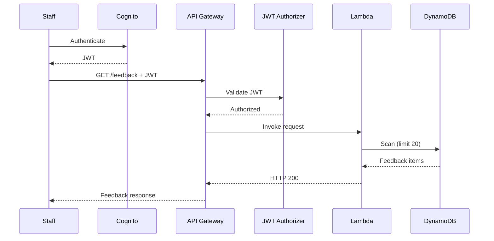

# Request Flow

This document describes the request paths implemented by the Allan Feedback System.

## Public Submission Flow

A customer or API client submits feedback through the public HTTP API:

```text
Customer/API Client
        |
        v
API Gateway -> POST /feedback -> Lambda -> validation -> DynamoDB PutItem -> HTTP 201
```

1. The customer or API client sends a JSON request to `POST /feedback` through API Gateway.
2. API Gateway invokes the Lambda handler.
3. Lambda validates the JSON body, rating, category, message, and optional fields.
4. A valid request is stored in DynamoDB using `PutItem`.
5. The API returns HTTP `201 Created` with the generated feedback ID.



## Invalid Submission Flow

Invalid input is rejected before it reaches DynamoDB:

```text
Customer/API Client -> API Gateway -> Lambda -> validation failure -> HTTP 400
```

Lambda returns HTTP `400 Bad Request` when the request is malformed or fails validation, such as an invalid rating, unsupported category, missing message, or invalid optional field. No `PutItem` operation is performed for the rejected request.

## Protected Retrieval Flow

Authorized staff retrieve feedback using Cognito authentication and a JWT:

```text
Staff -> Cognito authentication -> JWT -> API Gateway GET /feedback
      -> JWT authorizer -> Lambda -> DynamoDB Scan -> HTTP 200
```

1. Staff authenticate with Amazon Cognito and obtain a JWT.
2. The staff client sends the JWT in the `Authorization` header to `GET /feedback`.
3. API Gateway validates the token using its JWT authorizer.
4. The authorized request invokes Lambda.
5. Lambda uses DynamoDB `Scan`, limited to 20 items, and sorts results by `submittedAt`.
6. The API returns HTTP `200 OK` with the feedback items.



## Unauthorized Retrieval Flow

A staff member or client without a valid JWT cannot reach Lambda for feedback retrieval:

```text
Staff/client without valid JWT -> API Gateway -> JWT authorizer -> HTTP 401 without Lambda access
```

The API Gateway JWT authorizer rejects the request with HTTP `401 Unauthorized`. Because authorization fails at API Gateway, Lambda is not invoked and DynamoDB is not accessed.

## Internal Failure Flow

Unexpected application or database failures are handled without exposing implementation details:

```text
API Gateway -> Lambda -> DynamoDB/application failure
            -> generic HTTP 500 -> technical details to CloudWatch logs
```

The client receives a generic HTTP `500 Internal Server Error` response. Lambda logs the error type and relevant technical troubleshooting information to CloudWatch Logs rather than returning those details to the caller.
