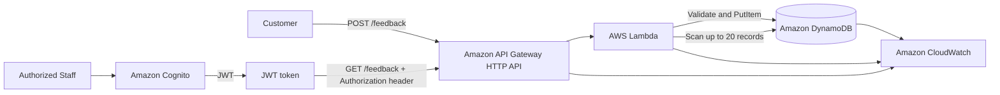

# Final Architecture

## Overview

The Allan Feedback System is a serverless customer feedback API implemented with managed AWS services and Terraform.

The architecture separates public customer submission from authenticated staff retrieval:

- `POST /feedback` is public and accepts customer feedback.
- `GET /feedback` is protected by Amazon Cognito JWT authentication for authorized staff.

Amazon API Gateway provides the HTTP entry point, AWS Lambda contains application logic, and Amazon DynamoDB stores feedback records. Amazon CloudWatch provides logs, metrics, dashboards, and Lambda error monitoring.

## Final Architecture Diagram


---

# Architecture Diagram



The POST and GET routes share the API Gateway, Lambda, and DynamoDB services while using different access controls.

---

# Components

## Amazon API Gateway

Amazon API Gateway HTTP API exposes the feedback endpoints over HTTPS.

The implemented routes are:

- `POST /feedback`
- `GET /feedback`

API Gateway invokes the Lambda integration and provides the JWT authorizer for the protected GET route. Development CORS currently allows all origins.

## AWS Lambda

The `allan-feedback-handler` Lambda function contains the application logic.

It validates request bodies, writes valid submissions to DynamoDB, retrieves feedback records, and returns generic responses for unexpected internal failures.

The Lambda deployment package is tracked as `lambda/feedback_handler.zip` because Terraform deploys it directly.

## Amazon DynamoDB

The `allan-feedback` DynamoDB table stores each feedback submission as an item using `feedbackId` as the partition key.

The table uses on-demand billing and has Point-in-Time Recovery enabled.

The current implementation uses `PutItem` for submissions and `Scan` for staff retrieval.

## Amazon Cognito

Amazon Cognito provides authentication for authorized staff.

API Gateway validates Cognito JWTs before allowing access to `GET /feedback`. The POST route does not require Cognito because customers must be able to submit feedback without staff accounts.

## Amazon CloudWatch

CloudWatch receives Lambda logs and provides metrics for Lambda, API Gateway, and DynamoDB.

The project includes a CloudWatch dashboard and a Lambda execution-error alarm. The Lambda log group retains logs for 14 days.

## Terraform

Terraform provisions and manages the AWS infrastructure as code, including the DynamoDB table, IAM role and policy, Lambda function, API Gateway, routes, JWT authorizer, Cognito resources, Lambda permission, CloudWatch log group, alarm, and dashboard.

Terraform variables define the AWS region, project name, and environment. Terraform outputs expose the API endpoint and Cognito identifiers.

---

# POST Request Flow

The public submission flow is:

1. A customer sends a JSON request to `POST /feedback`.
2. API Gateway receives the HTTPS request and invokes Lambda.
3. Lambda parses and validates the request body.
4. Lambda checks the rating, category, message, and optional field types.
5. Lambda generates a feedback ID and submission timestamp.
6. Lambda writes the item to DynamoDB using `PutItem`.
7. The API returns `201 Created` with the generated feedback ID.

Authentication is intentionally not required for this route.

Invalid input returns `400 Bad Request`. Unexpected database or processing failures return a generic `500 Internal Server Error`, while technical details are logged to CloudWatch.

---

# Authenticated GET Request Flow

The staff retrieval flow is:

1. An authorized staff user authenticates with Cognito.
2. Cognito issues a JWT token.
3. The staff client sends `GET /feedback` with `Authorization: Bearer <JWT_TOKEN>`.
4. API Gateway validates the JWT using the Cognito JWT authorizer.
5. API Gateway rejects missing or invalid tokens with `401 Unauthorized` before Lambda processing.
6. For a valid token, API Gateway invokes Lambda.
7. Lambda scans DynamoDB and limits the returned records to 20.
8. Lambda orders the records by `submittedAt`, with newest records first.
9. The API returns `200 OK` with the feedback data.

The JWT is used for request authorization and must not be stored in source control.

---

# Security Model

The security model uses separation of public and protected operations.

## Public Submission

`POST /feedback` is public by design. Lambda applies input validation before data is written.

## Protected Retrieval

`GET /feedback` requires a valid Cognito JWT through the API Gateway authorizer. Unauthenticated requests do not reach Lambda.

## IAM Least Privilege

The Lambda execution role is restricted to the DynamoDB actions required by the current application:

```text
dynamodb:PutItem
dynamodb:Scan
```

The permissions are scoped to the feedback table. Clients do not receive direct DynamoDB access.

## Data Protection and Errors

API communication uses HTTPS and DynamoDB provides encryption at rest. Unexpected internal errors return generic client responses instead of AWS or database implementation details.

## CORS

The development configuration allows all origins for testing. A production deployment should restrict CORS to the trusted frontend domain.

---

# Monitoring

CloudWatch monitoring is connected to the main serverless components:

- Lambda logs, invocations, errors, throttles, and duration
- API Gateway request count, 4xx responses, and 5xx responses
- DynamoDB consumed capacity and read/write throttle events

The project includes:

- the `allan-feedback-dashboard` CloudWatch dashboard
- the `allan-feedback-lambda-errors` Lambda error alarm
- the `/aws/lambda/allan-feedback-handler` log group with 14-day retention

Separate API Gateway and DynamoDB alarms are not currently implemented.

---

# Infrastructure as Code

Terraform is the source of truth for the implemented infrastructure. Resource references allow Terraform to infer dependencies between the table, IAM role, Lambda function, API Gateway integrations, authorizer, Cognito resources, permissions, alarm, and dashboard.

Terraform state is stored locally for development and ignored by Git. Production should use a secured remote Terraform backend with access control, encryption, state locking, and backups. A remote backend is not currently implemented.

---

# Scalability and Service Choices

API Gateway, Lambda, and DynamoDB were chosen because the workload is request-driven, variable, and suitable for usage-based serverless services.

- API Gateway provides a managed HTTPS API without an application server.
- Lambda runs validation and database operations only when requests arrive.
- DynamoDB provides managed key-value storage without database server administration.
- Cognito provides managed staff authentication.
- CloudWatch provides integrated service monitoring.

The architecture can scale beyond the current demonstration workload without provisioning application servers in advance. The primary current scaling limitation is that GET uses DynamoDB `Scan`, which becomes less efficient as the table grows.

The current architecture does not use EC2, RDS, S3 frontend hosting, or a customer-managed VPC. These resources are not required for the current serverless API and are not implemented in Terraform.

EC2 would introduce continuously managed compute, RDS would add relational database administration that the current item-based model does not require, and S3 frontend hosting is unnecessary because no frontend application is part of the current system. A customer-managed VPC is also not required for the present API Gateway, Lambda, DynamoDB, and Cognito design.

---

# Current Limitations

The implemented architecture has these limitations:

- GET uses DynamoDB `Scan` instead of a query-oriented access pattern.
- GET returns a maximum of 20 records.
- Pagination is not implemented.
- Development CORS allows all origins.
- POST is public and has no dedicated abuse-protection layer.
- Separate API Gateway and DynamoDB alarms are not configured.
- Terraform state is local for development.
- No frontend application is implemented.
- No CI/CD pipeline is implemented.

These limitations are documented rather than treated as implemented capabilities.

---

# Future Production Evolution

A production evolution of the system could include:

- replacing DynamoDB `Scan` with `Query`
- adding pagination and a suitable secondary index
- adding AWS WAF and API rate limiting
- restricting CORS to trusted frontend origins
- adding API Gateway, Lambda throttling, and DynamoDB throttling alarms
- moving Terraform state to a secured remote backend
- adding a CI/CD pipeline and automated security testing
- introducing optional asynchronous processing with Amazon SQS for high write bursts

These are future options and are not currently deployed resources.
